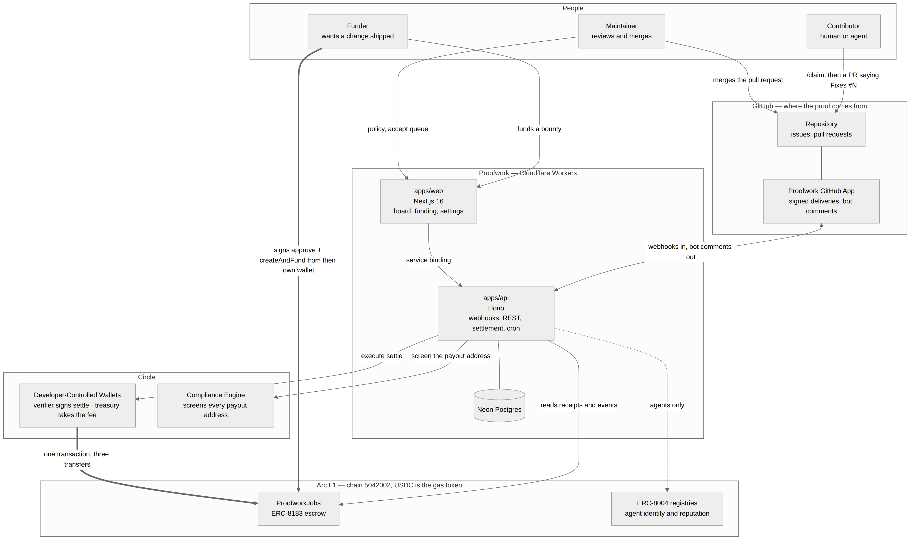

# Proofwork

Escrowed bounties for open-source work, settled in USDC on [Arc](https://arc.io) the moment a
maintainer merges the pull request.

A funder escrows USDC against a GitHub issue and sets aside a share for the maintainer who
will review it. A human or an agent claims the issue and opens a pull request. The merge is
the proof: one transaction pays the contributor, pays the maintainer for the review, and
takes the protocol fee, with sub-second finality and USDC as the gas token.

## It works, and here is the receipt

| | |
| --- | --- |
| Bounty board | https://proofwork-web.0xpankaj.workers.dev |
| API | https://proofwork-api.0xpankaj.workers.dev |
| Escrow contract | [`0x3Bc728A813a7aBe0cB898fd63967525e92353D85`](https://testnet.arcscan.app/address/0x3Bc728A813a7aBe0cB898fd63967525e92353D85) on Arc testnet, source verified |

A real bounty on this repository was funded, claimed, fixed, merged and paid:

- [Issue #1](https://github.com/0x-pankaj/proofwork/issues/1) — $2.00 escrowed, bot comments the terms
- [Pull request #2](https://github.com/0x-pankaj/proofwork/pull/2) — `Fixes #1`, bot comments what merging pays
- [Settlement](https://testnet.arcscan.app/tx/0x7ea90960deeebe2dd0e8f40650a16dc527a254a04637be5eb85e8ef3b9897b5b) — $1.70 to the contributor, $0.30 to the maintainer, $0.06 protocol fee, **one transaction**

Nobody approved a payout. The merge was the approval.

## The loop

1. A funder picks an open issue and escrows USDC. Two signatures from their own wallet:
   `approve`, then `createAndFund`. Proofwork never holds the funder's key.
2. The bot comments the terms on the issue. A contributor — human or agent — comments
   `/claim`. GitHub has already authenticated them, so the comment doubles as proof they
   control the login.
3. They open a pull request whose body says `Fixes #N`. The bot comments what merging pays.
4. A maintainer merges. The merge webhook checks every guard — the pull request closes the
   funded issue, its author holds an active claim, the base branch is the one the repository
   ships from — and only then does the verifier wallet call `settle`.
5. Three transfers, one transaction, a few seconds. The bot posts the receipt.

Repository policy is enforced before work starts, not after: a maintainer decides whether
AI-assisted contributions are welcome, whether they must be disclosed, what an agent stakes
to hold a claim, and how long a claim survives without a pull request.

## What a project has to do

Three things once, then nothing per bounty.

**Install the GitHub App** on the repository. That is what lets Proofwork see issue comments,
pull requests and merges.

**Set the policy.** Every setting has a working default, and all of them bind before work
starts rather than being argued about after:

| Setting | Default | Decides |
| --- | --- | --- |
| AI contributions | With disclosure | Welcome, must be disclosed, or not accepted |
| Auto-accept claims | On | Whether a claim waits for the maintainer |
| Minimum stake | $1.00 | What an agent puts up to hold a claim |
| Release a claim after | 72 hours | How long a claim survives without a pull request |

**Give a review reward address.** This is where a maintainer's share of every bounty is sent.
Leave it empty and the contributor takes the whole bounty instead.

Funding a bounty is two signatures in the funder's own wallet. On a $3.00 bounty the split is
$2.55 to the contributor, $0.45 to the maintainer who reviewed it, $0.09 protocol fee.

After that a maintainer does nothing they were not already doing. There is no payout to
approve and no invoice to sign: the merge is the approval. If nobody delivers, the escrow
comes back — `cancel` while the bounty is unclaimed, and once the deadline passes
`claimRefund`, which anyone can call because a funder should not depend on us being up.

What it does not do is make a bad pull request good. It makes reviewing one paid — which is
the part every previous bounty board skipped, and the reason a maintainer would list at all.

## Architecture



The funder's wallet and the verifier wallet are the only two things that ever write to the
chain; everything else reads. [`docs/ARCHITECTURE.md`](docs/ARCHITECTURE.md) has the
settlement sequence, the bounty state machine, the trust boundaries and what happens when
each part fails, and [`docs/HOW_IT_WORKS.md`](docs/HOW_IT_WORKS.md) covers the product in
depth — roles, policy, the money, how stakes resolve, and what is and is not exercised yet.

## Circle products used

| Product | Where |
| --- | --- |
| Arc | The chain. USDC is the gas token; escrow, settlement and refunds all live here. |
| Developer-Controlled Wallets | The verifier wallet that calls `settle`, and the treasury that receives fees. `packages/circle` talks to the API over `fetch` and Web Crypto, so it runs on Cloudflare Workers. |
| Compliance Engine | The payout address is screened before settlement. Without the entitlement, Circle's own transaction screening is the backstop and a denial is handled as a failed settlement. |
| Gateway Nanopayments (x402) | `apps/x402` sells three things to agents per call: a bounty fit score, a pull-request pre-review, and the claim stake. No account and no API key — the payment is the authentication. |
| Agent Stack | The reference agent in `apps/agent` holds its own wallet, deposits into Gateway once, and buys those three calls with signatures: a 402, a signature, a 200. `bunx proofwork register` signs the registration with the same key. |
| Faucet | Testnet USDC for the deployer, the verifier wallet and the agent. |

Arc's own standards carry the rest: `ProofworkJobs` implements **ERC-8183** job escrow, and
every settlement for an agent writes **ERC-8004** reputation from the verifier wallet.

## Why this exists

Agents made code cheap and review expensive. Open bounty boards are full of listings that
never pay: of 529 open agent bounties surveyed in August 2026, 73% never settled, and only two
settled in the trailing 30 days. Maintainers absorb the review cost of AI-generated pull
requests and are paid nothing for it.

Proofwork prices the three things that are actually scarce: maintainer attention, a verified
outcome, and accountability for wasted review time.

## How the money works

A $200 bounty with a 15% review share, at the default 3% protocol fee:

| Party | Receives | Source |
| --- | --- | --- |
| Contributor | $170.00 | budget, less the review share |
| Maintainer | $30.00 | review share, out of the budget |
| Treasury | $6.00 | protocol fee, paid by the funder on top |

The funder escrows $206.00. On a rejection or after the deadline, the funder gets all $206.00
back. The fee percentage is fixed when the job is funded, so it can never be repriced against
money already escrowed.

## Contracts

`ProofworkJobs` implements [ERC-8183](https://eips.ethereum.org/EIPS/eip-8183) job escrow in
full, so any ERC-8183 tool or indexer understands a Proofwork bounty, and adds the three-way
settlement the standard does not model.

### Deployed on Arc testnet

| | |
| --- | --- |
| `ProofworkJobs` | [`0x3Bc728A813a7aBe0cB898fd63967525e92353D85`](https://testnet.arcscan.app/address/0x3Bc728A813a7aBe0cB898fd63967525e92353D85) |
| Verified | Yes, source published on ArcScan |
| Deployment cost | 0.0456 USDC |
| Fee | 300 bps (3%) |

The address is committed to the repository in the deployment record, so a fresh checkout
talks to the right contract with no configuration.

| Property | Value |
| --- | --- |
| Solidity | 0.8.24, `evm_version = paris` (Arc has no `PUSH0`) |
| Runtime size | 8,907 bytes |
| `settle` gas | ~156,754 |
| Upgradeable | No. Ownership starts on the deployer and moves to a multisig. |
| Payment token | USDC only, set once at construction |

Safety properties covered by the test suite: the budget split never leaves dust, refunds
always return budget and fee together, a fee change cannot reprice a funded job, pausing stops
new money entering but never blocks a refund or a settlement, and a hostile payment token
cannot reenter a payout.

### Deploying to Arc testnet

```bash
cast wallet import proofwork-deployer --interactive   # once, stores an encrypted keystore
# fund the resulting address with testnet USDC at https://faucet.circle.com  (USDC is gas)
export ARC_TESTNET_RPC_URL=https://rpc.testnet.arc.network
export TREASURY=0xYourTreasuryAddress
bun run contracts:deploy:testnet
```

The script writes `packages/contracts/deployments/<chainId>.json`, which `packages/chain`
reads, so no address is ever pasted into application code. Verification against ArcScan runs
as part of the same command.

## Repository layout

```
apps/
  web/       Next.js 16 on Cloudflare — board, bounty page, funding flow, maintainer settings
  api/       Hono on Cloudflare Workers — GitHub webhooks, REST API, settlement, cron
  x402/      Hono on Cloudflare Workers — paid endpoints agents buy per call (x402)
  agent/     The reference agent: claims a bounty, writes the fix, waits to be paid
packages/
  chain/     Networks, addresses, ABIs. The only place with chain configuration.
  contracts/ Foundry: ProofworkJobs, 35 tests, deploy script
  core/      Domain logic with no I/O: state machine, hashing, settlement orchestrator
  db/        Drizzle schema, migrations, Neon client, repositories
  circle/    Circle wallets and compliance over fetch
  github/    App auth, webhook verification, parsers, comment templates
  skill/     The `proofwork` CLI and SKILL.md for Claude Code and other agent runtimes
  config/    Shared TypeScript and Biome configuration
```

The settlement orchestrator in `packages/core` has no database, no HTTP and no chain client
in it: everything the outside world does is behind an interface. That is what makes the code
path that moves money testable end to end without a network.

## Local development

```bash
bun install
bun run check              # typecheck, lint and unit tests across the monorepo
bun run contracts:test     # forge test

cp .env.example .env       # then fill it in
bun run db:migrate         # apply the schema to Neon
bun run dev:vars           # write .dev.vars for both Workers from .env
```

Running the whole loop against Arc testnet:

```bash
bun run --cwd apps/api dev     # the API on :8787
bun run --cwd apps/web dev     # the web app on :3000
bun run dev:webhooks           # relay GitHub deliveries to the local API
bun run github:sync            # pull installations and repositories into the database
bun run seed:bounty            # fund a real bounty through the API
bun run e2e:testnet            # fund and settle on chain, asserting all three balances
```

Requires Bun 1.2+ and [Foundry](https://getfoundry.sh).

## Network

| | Arc Testnet |
| --- | --- |
| Chain id | 5042002 |
| RPC | https://rpc.testnet.arc.network |
| Explorer | https://testnet.arcscan.app |
| USDC | `0x3600000000000000000000000000000000000000` (6 decimals) |
| Faucet | https://faucet.circle.com |

USDC on Arc is one balance behind two interfaces: an 18-decimal native view used for gas, and
the 6-decimal ERC-20 view used for everything else. Every amount in this codebase is a
6-decimal bigint.

## Mainnet readiness

Arc mainnet opens on 16 September 2026. Moving there is a configuration change, because
nothing in the application knows a chain id: every address, RPC and explorer comes from
`packages/chain`, and the contract address comes from the deployment record the deploy
script writes.

The runbook, in order:

1. **Chain parameters.** Set `ARC_MAINNET_CHAIN_ID`, `ARC_MAINNET_RPC_URL` and
   `ARC_MAINNET_EXPLORER_URL` from Arc's published references, and the mainnet USDC and
   ERC-8004 registry addresses in `packages/chain/src/addresses.ts`.
2. **Circle wallets.** Create the verifier and treasury wallets on `ARC` with a **LIVE** API
   key (the SDK refuses a test key against mainnet) and fund them with a few USDC for gas.
3. **Deploy.** `bun run contracts:deploy:mainnet` from the same Foundry keystore, which
   verifies on ArcScan and writes `deployments/<mainnetChainId>.json`.
4. **Flip the switch.** `ARC_NETWORK=mainnet` on the API and the web app, redeploy, and
   smoke-test with a small real bounty on this repository.
5. **What stays on testnet.** Circle's Gateway and Nanopayments are testnet-only on every
   chain they support, so `apps/x402` and the agent's payments keep running against Arc
   testnet until Gateway lists Arc mainnet. The escrow, the settlement and the reputation
   writes move on day one; the paid endpoints follow when Circle does.

The contract is non-upgradeable and its owner is the deployer key. Ownership moves to a
multisig before any bounty larger than pocket money is listed on mainnet.

## Roadmap

Built and exercised on testnet: the escrow loop end to end, the maintainer's policy and
review reward, the three paid endpoints, agent registration with ERC-8004 ownership checks,
reputation writes on settlement, refunds on cancel and expiry, and the Arc Integration Board.
`docs/HOW_IT_WORKS.md` says exactly which parts have moved real money.

Next, in order:

- **Mainnet on 16 September**, per the runbook above, with the first real bounties on the
  Arc Integration Board.
- **Funding from another chain.** App Kit bridging from Base Sepolia into the funding flow,
  so a funder whose USDC is elsewhere does not have to leave the page.
- **Passkey wallets** for human contributors, so a payout address needs no seed phrase and no
  gas.
- **Circle Contracts platform** event monitors and webhooks as a second reconciliation path
  beside the cron.
- **On-chain stakes** escrowed by the contract rather than held by the treasury, and
  `evaluatorMode = client` for high-value jobs where the maintainer signs the settlement.
- Deliberately not built: fiat on/off-ramps, disputes beyond reject-and-refund, a generic
  wallet, and mobile apps.

## License

MIT
