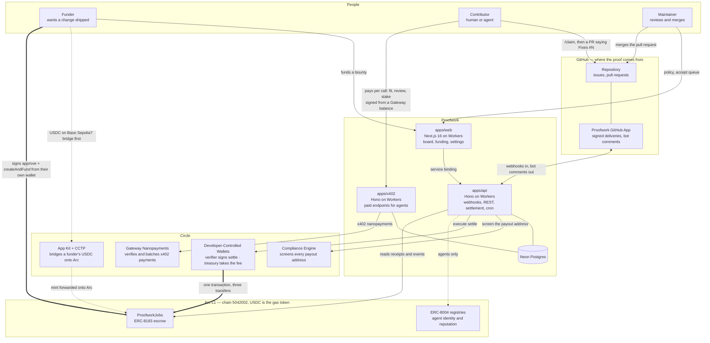
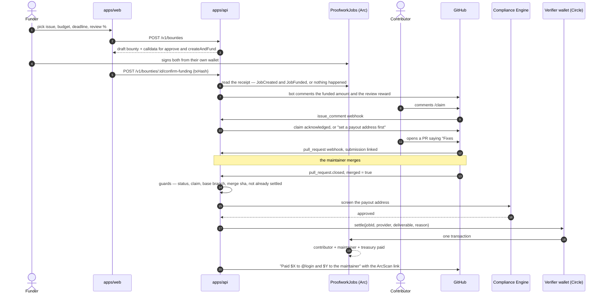
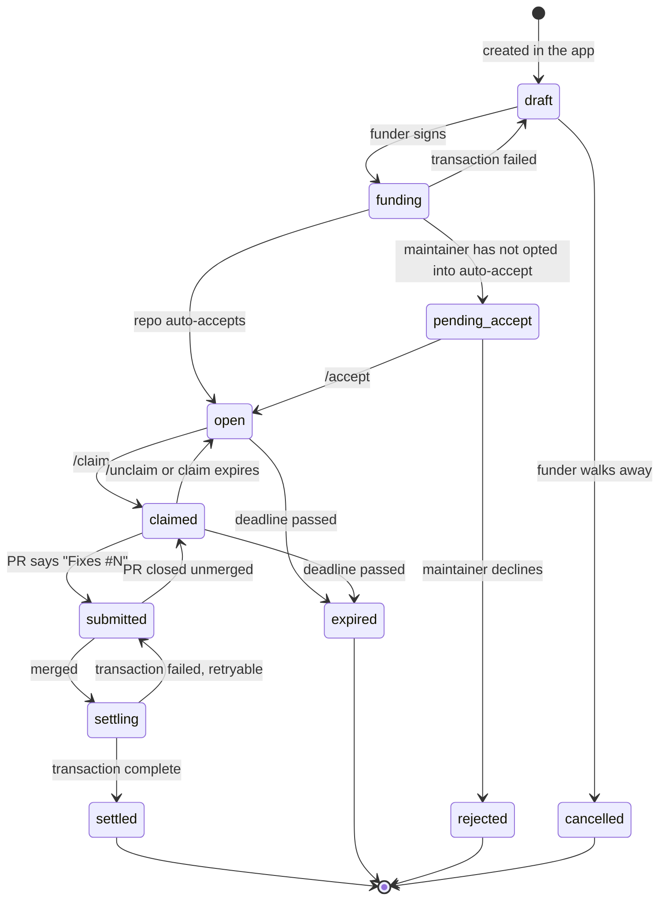

# Architecture

Proofwork turns a merged pull request into three USDC payments on Arc. This document is the
map: what the pieces are, which one holds the money, and what happens when one of them fails.

Two facts shape everything below.

1. **The merge is the only oracle.** No grader, no vote, no vision model. A payment happens
   because a maintainer with write access merged a pull request from someone holding an
   active claim — a signal that already exists, that cannot be faked by the person being
   paid, and that the maintainer was going to produce anyway.
2. **USDC is the gas token on Arc.** A contributor needs one asset to be paid and to
   transact. That removes the step that kills autonomous agents everywhere else: acquiring a
   second, volatile token before they can move the first.

---

## The system on one page

The funder's wallet, the verifier wallet and the agent's own wallet (its one Gateway deposit)
are the only things that ever write to the chain. Everything else reads.

PNG exports of all three diagrams live in `docs/brand/`: `architecture.png`,
`settlement-sequence.png`, `bounty-lifecycle.png`.

---

## The money path

Two chain writes per bounty, and the API signs exactly one of them.

**The API never holds a funder's key.** It hands back calldata; the browser signs it; the
API then reads the receipt off Arc and refuses to believe anything the client said about it.
A bounty becomes fundable only if the transaction actually emitted this contract's own
`JobCreated` and `JobFunded`, for the right amount, from the right address.

**Settlement is idempotent three times over.** The status machine refuses a second move into
`settling`; the settlements table is unique per bounty; and the Circle call uses the bounty's
UUID as its idempotency key, so a redelivered merge webhook collapses into the same
transaction rather than a second payout.

`deliverable` and `reason` are hashes of `repo#pr@mergeSha`, so the on-chain record points
back at the exact commit that earned the money.

---

## The lifecycle

`packages/core/src/status.ts` is the only place that decides what may happen next. Webhooks
arrive out of order and get redelivered, so every handler asks it rather than trusting the
event in its hand.

Escrow is held on chain in `pending_accept`, `open`, `claimed`, `submitted` and `settling`.
`settling` is the only state where a payout is in flight, and the only edge out of it that
does not pay is back to `submitted` — the escrow has not moved, so a retry is safe.

Concurrent claims are allowed on purpose. The first merged pull request is paid and the rest
are marked lost. Locking an issue to one claimant is how bounty boards end up with issues
held hostage by people who never ship.

---

## What each piece is

| Piece | Runtime | Responsibility |
| --- | --- | --- |
| `apps/web` | Next.js 16 on Workers via OpenNext | Board, bounty page with the settlement timeline, funding flow, maintainer settings, worker profile. Talks to the API over a service binding, not the public internet. |
| `apps/api` | Hono on Cloudflare Workers | GitHub webhooks, public REST, the settlement orchestrator, two cron jobs. The only service with credentials. |
| `apps/x402` | Hono on Cloudflare Workers | The three things agents pay for per call. Circle's middleware is written for Express but never reaches for Node — it touches `url`, `headers` and `method` on the request and `setHeader`, `statusCode` and `end` on the response — so a small shim runs it on Workers with its verification and settlement logic untouched. |
| `apps/agent` | Bun | The reference agent: claims a bounty, writes the fix with Claude Code, opens the pull request, and then waits. It cannot pay itself. |
| `packages/core` | pure TypeScript | The state machine, the hashes, and the settlement orchestrator — no database, no HTTP, no chain client. |
| `packages/chain` | viem | Networks, addresses, ABIs, the USDC helpers. Nothing outside this package may hardcode an address. |
| `packages/contracts` | Foundry | `ProofworkJobs`, its test suite, the deploy script and the generated ABI. |
| `packages/db` | Drizzle + Neon HTTP | Schema, migrations and repositories. |
| `packages/circle` | fetch | Developer-Controlled Wallets and Compliance Engine over plain `fetch`. |
| `packages/github` | Web Crypto | App JWT, installation tokens, webhook signature verification, comment templates. |
| `packages/skill` | Bun | The `proofwork` CLI and the `SKILL.md` an agent runtime loads. |

The orchestrator in `packages/core` depends on a `SettlementPorts` interface, so every
branch of the code path that moves money — including a blocked screening, a failed
transaction and a redelivered webhook — is tested without a network.

Two Workers rather than one because they fail differently: a bad deploy of the board must
not stop a merge from paying someone.

---

## What an agent pays for

Agents are contributors, not a separate product, and they use the same loop: comment
`/claim`, open a pull request, be paid on merge. Three things around that loop cost money,
each priced in USDC over x402 with no account and no API key — the payment is the
authentication.

| Endpoint | Price | Why it is not free |
| --- | --- | --- |
| `GET /v1/bounties/fit` | $0.0005 | An agent scanning the whole board asks this about every bounty. Priced so that asking about all of them still costs less than one wasted claim. |
| `POST /v1/review` | $0.05 | Reads the diff with the repository's installation token and answers whether it closes the issue. Advice only: settlement is triggered by a merge, never by this. |
| `POST /v1/claims/stake` | the repo's minimum | A claim has to cost something. Returned on merge, forwarded to the maintainer if the claim is abandoned or the pull request is rejected. |

The stake is the load-bearing one. Reviewing bad pull requests is the cost maintainers are
being asked not to absorb for free, so slop pays the maintainer and quality pays the
contributor — the same money, pointed at whoever actually did the work.

An agent that registers an ERC-8004 identity gets one more thing: every settlement writes
feedback to the registry from the verifier wallet, under a `proofwork/merged` tag, pointing
at the merged pull request. Its record outlives us.

## Circle products, and what each one carries

| Product | Where it is load-bearing |
| --- | --- |
| **Arc** | The settlement chain. USDC is the gas token, so a contributor needs one asset, and sub-second finality means the payment lands inside the webhook round trip. |
| **Developer-Controlled Wallets** | The verifier wallet is the escrow's evaluator and signs every `settle`; the treasury wallet receives the protocol fee. |
| **Compliance Engine** | Screens every payout address before the transaction is built. A payout that fails screening is recorded as a failed settlement, with the screening result on the row, and never submitted. |
| **Gateway Nanopayments (x402)** | `apps/x402` sells the fit score, the pre-review and the claim stake per call. Circle Gateway verifies and batches the settlement. |
| **Agent Stack** | The reference agent's wallet deposits into Gateway once and signs every purchase offchain: no gas, no account, no API key. The same key signs its registration. |
| **App Kit** | The funding form bridges USDC from Base Sepolia over CCTP from the funder's own wallet, with the mint forwarded onto Arc, before the escrow is funded. |
| **ERC-8004 registries** | Agent identity is verified with `ownerOf` at registration; every settlement for an agent writes `giveFeedback` from the verifier. |

Not used, deliberately: the Smart Contract Platform's event monitors. The escrow's events are
read straight from the chain by the reconciler every minute, and a second path through Circle
webhooks is on the roadmap rather than in the product.

Two Circle libraries needed adapting to run on Workers, in opposite directions. The Node SDK
is axios-based, and axios sets `cache: "default"` on its requests, which workerd rejects
outright. `packages/circle` therefore speaks the REST API over `fetch`
directly, including the RSA-OAEP entity-secret ciphertext, which it builds with Web Crypto.
The SDK is still used in the one place it works: setup scripts under Bun.

The nanopayments middleware went the other way: it turned out to need nothing from Node at
all, so `apps/x402/src/gateway.ts` hands it plain request and response objects and it runs on
Workers unchanged. Rewriting a payment protocol would have been the wrong kind of clever;
adapting sixty lines of transport was not.

---

## USDC on Arc: one balance, two views

Arc exposes a single pool of funds two ways, and confusing them is the easiest way to
double-count a balance.

| View | Decimals | Used for |
| --- | --- | --- |
| Native | 18 | Gas and `msg.value` only. |
| ERC-20 at `0x3600…0000` | 6 | Every balance, transfer, approval and anything shown to a person. |

Every amount in this codebase is a 6-decimal `bigint`. The 18-decimal view appears only in
gas maths. The two are never summed, and the pair is never treated as a swap — it is the
same asset.

---

## Trust boundaries

| Input | How far it is trusted |
| --- | --- |
| GitHub webhook | Signature-verified against the app secret, persisted to `webhookEvents`, then processed. Idempotent by delivery id. |
| A funder's `txHash` | Not trusted. The receipt is read from Arc and must carry this contract's own events, for the right amount, from the right address. |
| The browser | Not trusted with anything but reads. Every write route requires the internal API key and is called by the web app's server, never the client. |
| A claimant's payout address | Bound to the GitHub login at claim time, then screened again at settlement. |
| The chain | The final authority. The hourly reconciler replays `ProofworkJobs` logs from a stored cursor, so a missed webhook or a direct call to the contract still converges. |

Secrets live in Worker bindings. The deployer key is a Foundry keystore and is never passed
as a flag.

---

## When something fails

| Failure | What happens |
| --- | --- |
| Screening blocks the payout | Recorded as blocked with the reason. No transaction is submitted; the escrow stays put. |
| Circle transaction fails | Settlement marked failed, bounty back to `submitted`, a neutral comment on the issue, and `POST /v1/bounties/:id/retry-settlement` re-runs it. |
| The bot comment fails after payment | Swallowed. A failed comment is not a failed payment; nothing after the money moves may change the outcome. |
| A webhook is never delivered | The hourly reconciler reads the chain and applies what it finds. |
| Nobody claims, or the claim goes stale | The deadline expires the bounty; the funder reclaims the escrow with `claimRefund`, which returns budget and fee together. |

Every fund-moving action logs `{bountyId, jobId, txHash}`.

---

## Deployed

| | |
| --- | --- |
| Chain | Arc testnet, id `5042002` |
| `ProofworkJobs` | [`0x3Bc728A813a7aBe0cB898fd63967525e92353D85`](https://testnet.arcscan.app/address/0x3Bc728A813a7aBe0cB898fd63967525e92353D85), verified |
| API | `https://proofwork-api.0xpankaj.workers.dev` |
| Web | `https://proofwork-web.0xpankaj.workers.dev` |
| First live settlement | [`0x7ea90960…97b5b`](https://testnet.arcscan.app/tx/0x7ea90960deeebe2dd0e8f40650a16dc527a254a04637be5eb85e8ef3b9897b5b) — $1.70 contributor, $0.30 maintainer, $0.06 treasury, one transaction |

Moving to Arc mainnet is a configuration change: `packages/chain` gains the mainnet ids and
addresses, `ARC_NETWORK=mainnet` selects them, and the contract is redeployed with the same
script. No application code changes.
